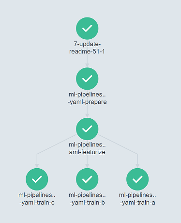

# `mlops`
_A scratch space to experiment with MLOps techniques..._

## Motivation

As a bit of a DevOps evangelist, I've always had a keen interest in how to build and scale things quickly.

A few years ago I was involved with a machine learning project - inheriting a classification model, a hastily written data processing script and a technical paper from a team of data scientists - and given the "simple" task of deploying it in a production setting 😆.

While the project was a success, I've always felt some clear opportunities were missed. In particular engaging early with stakeholders and the data scientists themselves could have made this a much more productive endeavour.

As always the tech industry is quick to adapt, and since then we have seen the adoption of a collection of practices known as "MLOps", essentially the application of the familiar DevOps mindset to ML-powered software.

There are a lot of shiny tools, frameworks and platforms that fall under the MLOps umbrella. Many of these focus on the operational aspects of ML services, namely deployment and monitoring. This is understandable, but an often overlooked aspect in delivering software quickly is ensuring a [good developer experience](https://martinfowler.com/articles/developer-effectiveness.html). Recalling my own experiences, it should have been easier for those involved in the delivery chain to test their changes, at production-scale, with tight feedback loops. So my focus here is to evaluate with toolchains that make this easier, and hopefully help others along the way.

## What's been done so far?

- [DVC](https://dvc.org/) for data set and ML model versioning
  - essentially extends `git` to provide versioning for ML pipelines and data artifacts.
  - DVC makes reproducibility easy, tying together data inputs, code, models and experiments to `git` history.
  - Pipelines are basically DAGs, and DVC will track pipeline dependencies and save r
- [Argo Workflows](https://argoproj.github.io/argo-workflows/) to run DVC pipelines at scale
  - The GitHub Action for this repo converts DVC pipeline to an Argo Workflow, allowing DVC pipeline stages to run in parallel in a Kubernetes cluster.
  - 

## What's next?

- Investigate more toolchains
  - [Metaflow](https://docs.metaflow.org/) looks interesting...
- Generate a real ML model that can serve predictions!
  - Currently the ML pipeline code calls stub functions that do nothing 😆
  - Maybe have a look on Kaggle...
- Extract DVC -> Argo Workflow functionality into a reusable GitHub Action
  - There have been a few [discussions](https://github.com/iterative/dvc/issues/1710) on how to orchestrate DVC pipelines across multiple nodes, so this might be useful to the wider community as an alternative to heavier, more complex platforms such as Kubeflow (which ironically uses Argo Workflows under the hood)
  